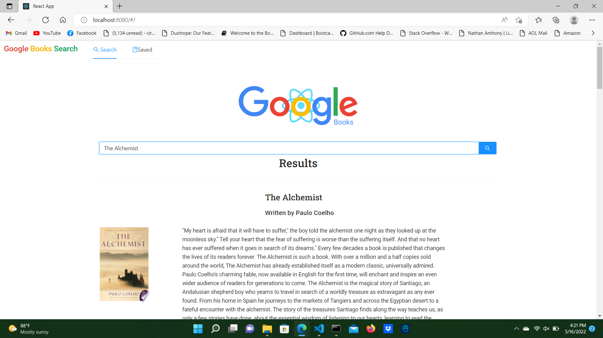

# Google Books React Search

## Table of Contents
 1. [Description](#description)
 2. [Installation](#installation)
 3. [Usage](#usage)
 4. [Contributing](#contributing)
 5. [Tests](#tests)
 6. [License](#license)
 7. [Questions](#questions)

 

## Description
### Google Books React Search is an application that allows users to search the Google Books database and store books of interest for later viewing.
## Installation
### None neccesary.
## Usage
### Simply navigate to the url here: 
## Contributing
### 1. Fork the repository on Github. 2. Clone the project to your own machine. 3. Commit changes to your branch. 4. Push your work back up to your own fork. 5. Submit a pull request so we can review your changes.
## Tests
### None.
## License
### Distributed under the MIT_License
## Questions
### Email: definitelyisntme@gmail.com
### Github: [https://github.com/Pegasoos](https://github.com/Pegasoos)